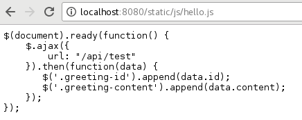
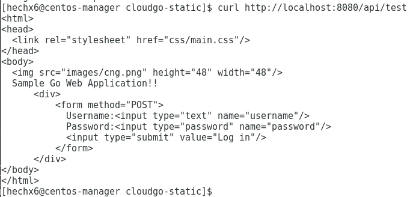
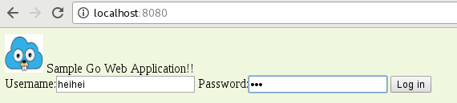
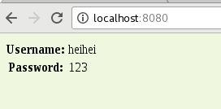
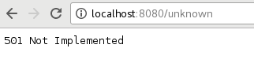

# CloudGo-io
Service Computing course homework: a simple web service program.  

## 使用的库
* Negroni  
* Gorilla/mux  
* Render  

## 项目结构
```
|-- cloudgo
  |-- assets
    |-- css
      |-- main.css
    |-- images
      |-- cng.png
    |-- js
      |-- hello.js
    |-- favicon.ico
  |-- service
    |-- home.go
    |-- server.go
  |-- templates
    |-- index.html
    |-- table.html
  |-- main.go
```

## 运行
1. 在cloudgo目录下运行 ```go run main.go ```  
2. 打开浏览器，输入地址 localhost：8080  

## 测试结果
1. 支持静态文件服务  
  
2. 支持简单js访问  
  
3. 提交表单，并输出一个表格  
提交表单  
  
打印表单  
  
4.对/unknown给出开发中的提示，返回码501  
  

